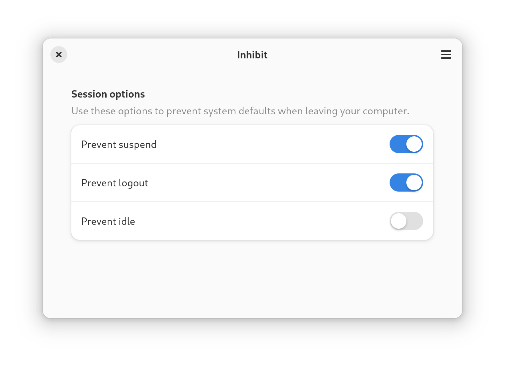
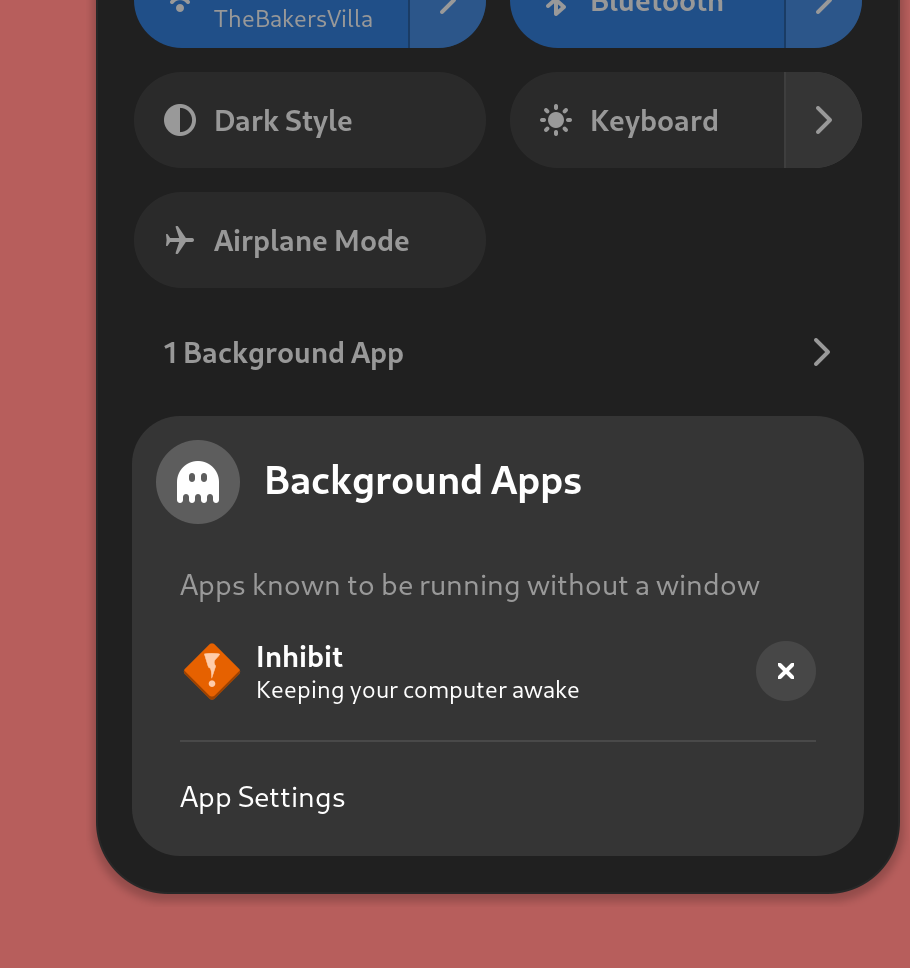

# Inhibit

Inhibit is a simple app that prevents your computer from suspending, logging out, or idling.

It uses the background portal to stay open on your system indefinitely.

## Opening at startup

You can use GNOME Tweaks to launch Inhibit on startup. Inhibit remembers your previous session options.